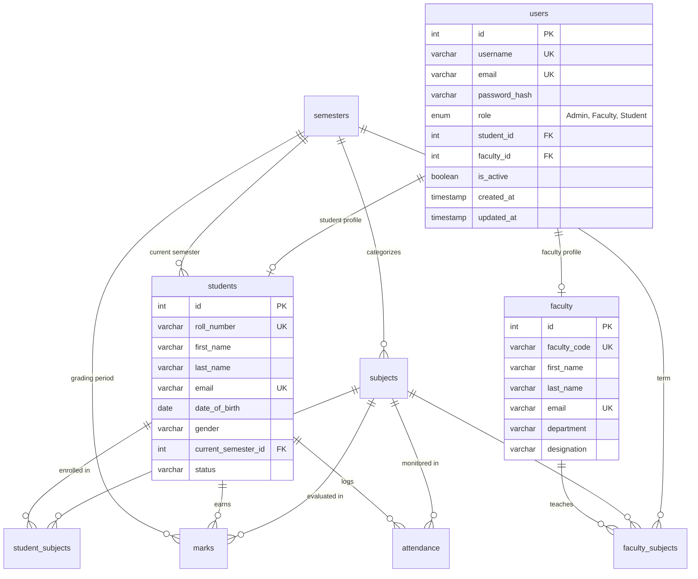

# Student Management System (SMS) - Version 2.0

A production-ready, secure, and modular Student Management System built using **Python**, **Flask**, and **MySQL**, featuring backend-enforced **Role-Based Access Control (RBAC)**, **Admin-Only User Registration**, **JNTUH 10-Point SGPA & CGPA Calculation**, role-tailored **Analytics Dashboards**, and **Multi-Format Report Exports (JSON, CSV, PDF)**.

---

## Table of Contents
1. [Core Features in Version 2.0](#1-core-features-in-version-20)
2. [Architecture & Design](#2-architecture--design)
3. [JNTUH SGPA & Grading System](#3-jntuh-sgpa--grading-system)
4. [Admin-Only User Registration Architecture](#4-admin-only-user-registration-architecture)
5. [Role-Based Access Control (RBAC) Matrix](#5-role-based-access-control-rbac-matrix)
6. [Database Schema (3NF)](#6-database-schema-3nf)
7. [Project Folder Structure](#7-project-folder-structure)
8. [Pre-Configured Accounts](#8-pre-configured-accounts)
9. [Setup & Installation](#9-setup--installation)
10. [Database Initialization & Migration](#10-database-initialization--migration)
11. [Running the Application](#11-running-the-application)
12. [Running the Test Suite](#12-running-the-test-suite)
13. [V2 API Documentation](#13-v2-api-documentation)
14. [Report Export Center](#14-report-export-center)

---

## 1. Core Features in Version 2.0

Version 2.0 provides an enterprise-grade academic management architecture with four core pillars:

1. **Internal RBAC & IDOR Protection**:
   - Supported Roles: **Admin**, **Faculty**, and **Student**.
   - **Internal Authorization**: RBAC operates as an internal backend security mechanism. Users cannot choose their role during login or self-assign privileges.
   - Backend-enforced decorators (`@login_required`, `@roles_required`) and object-level authorization helpers (`check_student_scope`, `check_subject_management_scope`).
   - Complete IDOR (Insecure Direct Object Reference) defense: Students are strictly isolated to their own academic profiles, marks, attendance, and reports.
   - Dual authentication: Cryptographically signed HTTP-only session cookies and bearer tokens (`itsdangerous`).

2. **Admin-Only User Registration**:
   - **No Public Registration based on roles(faculty/admin)**: Public signup endpoints and self-registration forms are eliminated.
   - Only authenticated Administrators can provision new accounts (**Student**, **Faculty**, or **Admin**).
   - Unauthenticated access to `/register` yields `401 Unauthorized`. Non-admin access yields `403 Forbidden`.
   - Admin enters user details $\to$ system auto-provisions or links corresponding student/faculty records $\to$ user can immediately sign in.

3. **JNTUH Academic SGPA & CGPA Calculation**:
   - Implemented strictly according to **JNTUH (Jawaharlal Nehru Technological University Hyderabad)** academic regulations.
   - **10-Point Absolute Grading Scale**: Letter grades ($O, A+, A, B+, B, C, F$) and grade points ($10, 9, 8, 7, 6, 5, 0$).
   - **Credit-Weighted SGPA Formula**: $\text{SGPA} = \frac{\sum (C_i \times G_i)}{\sum C_i}$ rounded to 2 decimal places.
   - **JNTUH Percentage Conversion**: $\text{Equivalent } \% = (\text{CGPA} - 0.5) \times 10$.

4. **Role-Appropriate Analytics & Multi-Format Reports**:
   - **Student Portal**: Subject-wise marks, attendance percentages, SGPA/CGPA, performance trends, and official PDF transcripts.
   - **Faculty Portal**: Course load, student attendance, class averages, pass rates, and mark entry for assigned courses.
   - **Admin Portal**: Institutional KPIs, department distribution, course management, and User Management.
   - Export formats: **Web JSON**, **RFC 4180 CSV**, and **Vector PDF** via `reportlab`.

---

## 2. Architecture & Design

The application follows a clean **3-Tier Layered Architecture**:

```
[ Web Browser (Dashboard/Login/Admin User Mgmt) / REST Clients ]
                              │
                              ▼
                 [ Security & Auth Guard ]
    (Session Cookie & Bearer Token Verification, Server-side RBAC)
                              │
                              ▼
              [ Flask API Layer (Blueprints) ]
        (Route handling, validation, JSON/CSV/PDF responses)
                              │
                              ▼
             [ Service Layer (Business Logic) ]
     (JNTUH SGPA/CGPA engine, user provisioning, ReportLab generator)
                              │
                              ▼
               [ Repository / DAO Layer ]
     (Parameterized SQL queries, CRUD operations, transactions)
                              │
                              ▼
               [ PyMySQL Connection Pool ]
            (ACID transaction managers, parameter binding)
                              │
                              ▼
              [ MySQL 8.0+ Database (3NF) ]
       (Relational tables, foreign keys, indexes, constraints)
```

---

## 3. JNTUH SGPA & Grading System

Under JNTUH regulations, student evaluation follows an absolute 10-point scale:

### JNTUH Absolute Grading Scale

| Percentage of Marks Secured | Letter Grade | Grade Points ($G_i$) | Description |
| :--- | :---: | :---: | :--- |
| $\ge 90\%$ | **O** | **10.0** | Outstanding |
| $80\% - 89.99\%$ | **A+** | **9.0** | Excellent |
| $70\% - 79.99\%$ | **A** | **8.0** | Very Good |
| $60\% - 69.99\%$ | **B+** | **7.0** | Good |
| $50\% - 59.99\%$ | **B** | **6.0** | Above Average |
| $40\% - 49.99\%$ | **C** | **5.0** | Pass *(Minimum Pass Grade)* |
| $< 40\%$ | **F** | **0.0** | Fail |

### Mathematical Formulas

1. **Semester Grade Point Average (SGPA)**:
   $$\text{SGPA} = \frac{\sum_{i=1}^{N} (C_i \times G_i)}{\sum_{i=1}^{N} C_i}$$
   where $C_i$ is the credit weight of subject $i$, and $G_i$ is the grade point earned in subject $i$.

2. **Cumulative Grade Point Average (CGPA)**:
   $$\text{CGPA} = \frac{\sum_{j=1}^{M} (C_j \times G_j)}{\sum_{j=1}^{M} C_j}$$
   computed across all completed semesters.

3. **Official JNTUH Percentage Equivalent**:
   $$\text{Equivalent Percentage (\%)} = (\text{CGPA} - 0.5) \times 10$$

---

## 4. User Registration Architecture

SMS V2 provides a secure account creation system:

### 4.1 Admin-Only Provisioning (Faculty, Admin, & Student)
Privileged accounts (Faculty and Admin) can only be created by an authenticated Administrator:

```text
Admin Login (Credentials verified)
              ↓
Admin Dashboard → User Management Tab
              ↓
Click "+ Create User"
              ↓
Enter Details:
  • Name: Ravi Kumar
  • Email: ravi@example.com
  • Password: ****************
  • Role: Student (or Faculty / Admin)
  • Optional: Roll Number / Faculty Code
              ↓
POST /api/v1/auth/register (Requires Admin Session)
              ↓
Backend Provisions User in MySQL:
  • Hashes password securely (PBKDF2/SHA-256)
  • Auto-links or creates Student / Faculty record
              ↓
New user logs in with their credentials and accesses their portal
```

### 4.2 Public Student Self-Signup
Students can self-register directly via the public portal:
- Accessible at `/signup` (or `/signup.html`) without login.
- Direct API endpoint: `POST /api/v1/auth/signup`.
- **Enforced Student Role**: Public registration strictly forces `role = "Student"`. Any client-submitted parameters attempting to gain privileges (`role=admin`, `is_admin`, `faculty_id`) are stripped and rejected server-side.
- Automatically links to an existing student profile if roll number matches, or provisions a new student record in MySQL.
- Direct signup prompt available on `/login`: *"Don't have an account? Sign up as Student"*.

---

## 5. Role-Based Access Control (RBAC) Matrix

| Endpoint | Method | Admin | Faculty | Student | Security Policy |
| :--- | :---: | :---: | :---: | :---: | :--- |
| `/signup` (Web) | `GET/POST`| ✅ | ✅ | ✅ | Public student signup form and submission handler |
| `/api/v1/auth/signup` | `POST` | ✅ | ✅ | ✅ | Public student self-registration (Forces Student role) |
| `/api/v1/auth/login` | `POST` | ✅ | ✅ | ✅ | Public sign-in; returns session cookie + bearer token |
| `/api/v1/auth/logout` | `POST` | ✅ | ✅ | ✅ | Clears session cookie and invalidates client state |
| `/api/v1/auth/me` | `GET` | ✅ | ✅ | ✅ | Returns authenticated user profile and role |
| `/api/v1/auth/register` | `POST` | ✅ | ❌ | ❌ | **Admin Only**: Creates new user accounts |
| `/api/v1/auth/users` | `GET` | ✅ | ❌ | ❌ | **Admin Only**: Lists registered system accounts |
| `/register` (Web) | `GET/POST`| ✅ | ❌ | ❌ | **Admin Only**: Returns 401 unauth / 403 forbidden |
| `/api/v1/faculty/**` | Any | ✅ | ❌ | ❌ | Admin only |
| `/api/v1/students` | `POST` | ✅ | ❌ | ❌ | Admin only |
| `/api/v1/students` | `GET` | ✅ | ✅ | ❌ | Students restricted to their own record |
| `/api/v1/students/<id>` | `GET` | ✅ | ✅* | ✅* | `*` IDOR Protection: Faculty must teach course; Student must own ID |
| `/api/v1/analytics/student/<id>` | `GET` | ✅ | ✅* | ✅* | `*` Scoped by enrollment; students blocked from other students |
| `/api/v1/analytics/student/me` | `GET` | ❌ | ❌ | ✅ | Automatically resolves student ID from active session |
| `/api/v1/analytics/faculty` | `GET` | ✅ | ✅ | ❌ | Aggregates metrics across assigned courses |
| `/api/v1/analytics/overview` | `GET` | ✅ | ❌ | ❌ | System-wide performance and enrollment statistics |
| `/api/v1/reports/academic` | `GET` | ✅ | ✅* | ✅* | Supports `?format=json\|csv\|pdf` with IDOR checks |
| `/api/v1/reports/marks` | `GET` | ✅ | ✅* | ✅* | Marks registry scoped by permissions |
| `/api/v1/reports/attendance` | `GET` | ✅ | ✅* | ✅* | Attendance registry scoped by permissions |
| `/api/v1/reports/subject/<id>` | `GET` | ✅ | ✅* | ❌ | Course class performance (assigned faculty only) |
| `/api/v1/reports/semester/<id>`| `GET` | ✅ | ✅ | ❌ | Term-level performance breakdown |

---

## 6. Database Schema (3NF)



---

## 7. Project Folder Structure

```
student_system/
├── .env.example              # Template environment configuration
├── .env                      # Local configuration (Git-ignored)
├── requirements.txt          # Dependencies (Flask, PyMySQL, reportlab, waitress)
├── config.py                 # Centralized environment loader
├── run.py                    # Application WSGI entry point
├── app/
│   ├── __init__.py           # Application Factory, Blueprint registration & web routes
│   ├── db.py                 # Thread-safe MySQL connection & transaction pool
│   ├── api/                  # Flask Blueprints (API endpoints)
│   │   ├── auth.py           # Admin registration, login, logout, /me, and /users
│   │   ├── analytics.py      # Student, faculty, and overview analytics routes
│   │   ├── reports.py        # Multi-format reports (JSON, CSV, PDF) with RBAC
│   │   ├── faculty.py        # Faculty CRUD & course assignment
│   │   ├── students.py       # Student CRUD & enrollment
│   │   ├── subjects.py       # Subject CRUD & department filters
│   │   ├── semesters.py      # Semester CRUD & active term toggle
│   │   ├── marks.py          # Assessment grading & atomic batch operations
│   │   └── attendance.py     # Attendance tracking & batch operations
│   ├── services/             # Business & calculation logic
│   │   ├── auth_service.py   # Admin user creation, password verification
│   │   ├── mark_service.py   # JNTUH 10-point scale grading & marks enrichment
│   │   ├── report_service.py # JNTUH SGPA/CGPA transcript engine & alerts
│   │   ├── analytics_service.py # Dynamic metrics, comparisons & trends
│   │   ├── report_generator.py  # ReportLab PDF & CSV streaming generator
│   │   ├── student_service.py
│   │   └── attendance_service.py
│   ├── repositories/         # Parameterized SQL data access layer
│   │   ├── user_repo.py      # User authentication queries
│   │   ├── faculty_repo.py   # Faculty records & teaching assignments
│   │   ├── student_repo.py
│   │   ├── subject_repo.py
│   │   ├── semester_repo.py
│   │   ├── mark_repo.py
│   │   └── attendance_repo.py
│   ├── templates/            # Frontend interfaces
│   │   ├── dashboard.html    # Role-tailored dashboard with Admin User Management
│   │   ├── login.html        # Clean, role-agnostic sign-in form
│   │   └── register.html     # Admin-only user creation interface
│   └── utils/                # Cross-cutting utilities
│       ├── auth.py           # RBAC decorators, token signing, IDOR validation
│       ├── exceptions.py     # Custom exceptions (401, 403, 404, 409, 422)
│       ├── responses.py      # Standardized JSON response envelope
│       └── validators.py     # Payload validators & parameter sanitization
├── schema/
│   ├── schema.sql            # Base MySQL DDL schema
│   ├── migrate_v2.py         # Additive V2 migration script (preserves existing data)
│   ├── seed.sql              # Base seed data
│   └── init_db.py            # Database initializer script
└── tests/                    # Automated test suite (43 tests, 100% passing)
    ├── conftest.py           # SQLite in-memory test database fixture
    ├── test_v2_features.py   # RBAC, IDOR, admin-only registration, login & exports
    ├── test_marks.py         # JNTUH 10-point grading & SGPA calculation tests
    ├── test_reports.py       # JNTUH transcript & attendance alert tests
    ├── test_students.py      # Student profile & enrollment tests
    ├── test_subjects.py      # Subject & department tests
    ├── test_semesters.py     # Semester validation tests
    ├── test_attendance.py    # Attendance logging & summary tests
    ├── test_api_common.py    # Error handling & status code tests
    └── test_validators.py    # Input validation tests
```

---

## 8. Pre-Configured Accounts

The system includes pre-seeded administrative and academic accounts:

| Role | Username / Email | Password | Linked Entity / Permissions |
| :--- | :--- | :--- | :--- |
| **Admin** | `charan` (`bijjamcherry@gmail.com`) | `CherRY123@@` | Full administrative access across all modules |

---

## 9. Setup & Installation

### Prerequisites
* **Python**: Version 3.10 or higher
* **MySQL Server**: Version 8.0 or higher

### Steps

1. **Navigate to the Directory**:
   ```powershell
   cd C:\Users\bijja\student_web\student_system
   ```

2. **Activate Virtual Environment** (Optional):
   ```powershell
   python -m venv venv
   .\venv\Scripts\activate
   ```

3. **Install Dependencies**:
   ```powershell
   pip install -r requirements.txt
   ```

4. **Configure Environment Variables (`.env`)**:
   ```env
   DB_HOST=localhost
   DB_PORT=3306
   DB_USER=student_app
   DB_PASSWORD=your_password_here
   DB_NAME=student_management_db

   FLASK_ENV=development
   FLASK_DEBUG=0
   PORT=5000
   SECRET_KEY=your-secure-random-secret-key
   ```

---

## 10. Database Initialization & Migration

* **Apply V2 Migration (Preserves All Existing Data)**:
  ```powershell
  python schema/migrate_v2.py
  ```
  *Creates `faculty`, `users`, and `faculty_subjects` tables without altering or deleting existing student records.*

* **Fresh Database Setup (Optional)**:
  ```powershell
  python schema/init_db.py --seed
  ```

---

## 11. Running the Application

### Development Mode
```powershell
python run.py
```

### Production WSGI Mode (Waitress)
```powershell
python -m waitress --port=5000 run:app
```

### Web Access Endpoints
* **Interactive Portal**: `http://localhost:5000/dashboard`
* **Sign In Page**: `http://localhost:5000/login`
* **Admin User Registration**: `http://localhost:5000/register` *(Requires Admin session)*

---

## 12. Running the Test Suite

All 43 unit, integration, and security tests execute using the automated in-memory test runner:

```powershell
python -m pytest -v
```

```text
============================= test session starts =============================
platform win32 -- Python 3.14.7, pytest-9.1.1, pluggy-1.6.0
rootdir: C:\Users\bijja\student_web\student_system
collected 43 items

tests\test_api_common.py .....                                           [ 11%]
tests\test_attendance.py ...                                             [ 18%]
tests\test_marks.py .....                                                [ 30%]
tests\test_reports.py ..                                                 [ 34%]
tests\test_semesters.py ..                                               [ 39%]
tests\test_students.py .......                                           [ 55%]
tests\test_subjects.py ...                                               [ 62%]
tests\test_v2_features.py .....                                          [ 74%]
tests\test_validators.py ...........                                     [100%]

============================= 43 passed in 1.81s ==============================
```

---

## 13. V2 API Documentation

### Authentication & Users (`/api/v1/auth`)

| Endpoint | Method | Authorization | Description |
| :--- | :---: | :---: | :--- |
| `/api/v1/auth/login` | `POST` | Public | Authenticates username/email and password; sets session cookie and returns token. |
| `/api/v1/auth/logout` | `POST` | Authenticated | Clears server-side session and authenticated cookies. |
| `/api/v1/auth/me` | `GET` | Authenticated | Retrieves current authenticated profile, role, and linked identifiers. |
| `/api/v1/auth/register` | `POST` | **Admin Only** | Creates a new Student, Faculty, or Admin account. Auto-provisions linked profile. |
| `/api/v1/auth/users` | `GET` | **Admin Only** | Lists all registered accounts with role filters and pagination. |

### Analytics (`/api/v1/analytics`)

| Endpoint | Method | Authorization | Description |
| :--- | :---: | :---: | :--- |
| `/api/v1/analytics/student/<id>` | `GET` | Admin / Scoped Faculty / Self | Student performance analytics (JNTUH SGPA, CGPA, grades, trends). |
| `/api/v1/analytics/student/me` | `GET` | Student | Resolves student ID from session and returns self analytics. |
| `/api/v1/analytics/faculty` | `GET` | Faculty / Admin | Course averages, pass rates, and enrollments across assigned classes. |
| `/api/v1/analytics/overview` | `GET` | Admin | Institutional overview: active students, faculty, subjects, and alerts. |

### Reports (`/api/v1/reports`)

All report endpoints support `?format=json` (default), `?format=csv`, and `?format=pdf`.

| Endpoint | Method | Parameters | Description |
| :--- | :---: | :---: | :--- |
| `/api/v1/reports/academic` | `GET` | `student_id`, `format` | Complete academic transcript with JNTUH SGPA, credits, and grades. |
| `/api/v1/reports/marks` | `GET` | `subject_id`, `semester_id`, `student_id`, `format` | Marks registry with scores, letter grades, and percentages. |
| `/api/v1/reports/attendance` | `GET` | `subject_id`, `student_id`, `date_from`, `date_to`, `format` | Attendance registry with present/absent logs. |
| `/api/v1/reports/subject/<id>` | `GET` | `subject_id`, `format` | Class performance report: course average %, pass rate %, distribution. |
| `/api/v1/reports/semester/<id>`| `GET` | `semester_id`, `format` | Semester term report: enrolled subjects and department breakdowns. |
| `/api/v1/reports/attendance/low`| `GET` | `threshold` (default 75) | Identifies students whose attendance rate falls below threshold. |

---

## 14. Report Export Center

- **Web JSON (`?format=json`)**: Standardized API response format (`success`, `message`, `data`).
- **RFC 4180 CSV (`?format=csv`)**: Formatted comma-separated file download for spreadsheet analysis.
- **Vector PDF (`?format=pdf`)**: Programmatically generated using `ReportLab`:
  - University/Institution header banner.
  - Student metadata definition cards (Roll Number, Name, Status, CGPA).
  - Clean data tables with alternating row fills and letter grade badges.
  - Multi-page dynamic footers with page counters (`Page X of Y`).
