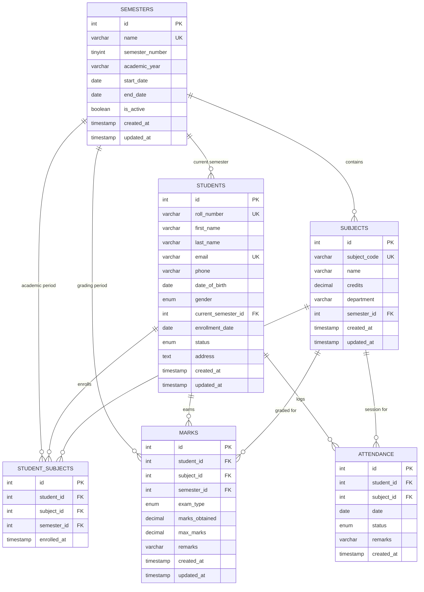

# Student Management System (SMS) - Version 1.0

A production-style, modular, and scalable Student Management System built using **Python** and **MySQL**, powered by a pure **Flask API**.

---

## Table of Contents
1. [Architecture & Design](#1-architecture--design)
2. [Database Schema (3NF)](#2-database-schema-3nf)
3. [Project Folder Structure](#3-project-folder-structure)
4. [Setup & Installation](#4-setup--installation)
5. [Database Initialization](#5-database-initialization)
6. [Running the Application](#6-running-the-application)
7. [Running the Test Suite](#7-running-the-test-suite)
8. [API Documentation](#8-api-documentation)
9. [Key Design Decisions](#9-key-design-decisions)

---

## 1. Architecture & Design

The application follows a clean **Layered Architecture** adhering to the Separation of Concerns (SoC) principle:

```
[ HTTP Requests / Clients ]
            │
            ▼
[ Flask API Layer (Blueprints) ]  <--- Route handling, parameter parsing, HTTP status codes
            │
            ▼
[ Service Layer (Business Logic) ] <--- Validation, GPA/grade calculations, business rules
            │
            ▼
[ Repository / DAO Layer ]       <--- Parameterized SQL queries, data access abstraction
            │
            ▼
[ Database Layer (PyMySQL Pool) ] <--- Connection pooling, ACID transaction context managers
            │
            ▼
[ MySQL 8.0+ Database (3NF) ]    <--- Relational tables, Foreign Keys, Indexes, Constraints
```

### Core Features:
- **Student Profiles**: Full personal and academic profiles, enrollment tracking, status management (Active, Inactive, Suspended, Graduated), course enrollment junction table.
- **Subjects & Departments**: Course codes, credit hours, department categorization, semester assignment.
- **Semesters**: Academic year tracking, date bounds validation, single active semester enforcement.
- **Marks & Grading**: Multi-assessment support (Quiz, Assignment, Midterm, Final, Practical), score bounds validation, automatic grade & grade-point calculation, atomic batch marks entry.
- **Attendance**: Daily tracking (Present, Absent, Late, Excused), duplicate prevention, attendance rate calculation with configurable low-attendance warning alerts.
- **Reporting & Transcripts**: Credit-weighted semester GPA and Cumulative GPA (CGPA) generation, student academic transcripts, attendance warnings.

---

## 2. Database Schema (3NF)

The database schema is fully normalized to **Third Normal Form (3NF)** with explicit foreign keys, cascade actions, unique constraints, and optimized indexes.



---

## 3. Project Folder Structure

```
student_management_system/
├── .env.example              # Template environment variables
├── .env                      # Local environment configuration (Git-ignored)
├── .gitignore                # Production Python/IDE gitignore
├── requirements.txt          # Python dependencies
├── config.py                 # Centralized configuration class & env loader
├── run.py                    # Application entry point
├── app/
│   ├── __init__.py           # Flask app factory, blueprints & global error handlers
│   ├── db.py                 # Thread-safe MySQL connection & transaction management
│   ├── api/                  # Pure Flask Blueprints (API endpoints)
│   │   ├── __init__.py
│   │   ├── students.py       # Student CRUD, search, filter, enrollment
│   │   ├── subjects.py       # Subject CRUD, department/semester filter
│   │   ├── semesters.py      # Semester CRUD, active semester toggle
│   │   ├── marks.py          # Marks recording, batch transactions
│   │   ├── attendance.py     # Attendance logging, batch recording, summary
│   │   └── reports.py        # Academic transcripts, low-attendance alerts
│   ├── services/             # Business logic layer
│   │   ├── __init__.py
│   │   ├── student_service.py
│   │   ├── subject_service.py
│   │   ├── semester_service.py
│   │   ├── mark_service.py
│   │   ├── attendance_service.py
│   │   └── report_service.py
│   ├── repositories/         # Parameterized SQL data access layer
│   │   ├── __init__.py
│   │   ├── student_repo.py
│   │   ├── subject_repo.py
│   │   ├── semester_repo.py
│   │   ├── mark_repo.py
│   │   └── attendance_repo.py
│   └── utils/                # Cross-cutting utilities
│       ├── __init__.py
│       ├── exceptions.py     # Custom exceptions (ConflictError, NotFoundError, etc.)
│       ├── responses.py      # Standardized JSON response envelope
│       └── validators.py     # Sanitization, regex, and business rule validators
├── schema/
│   ├── schema.sql            # MySQL DDL with constraints, checks, indexes
│   ├── seed.sql              # Realistic seed data for testing and demo
│   └── init_db.py            # CLI script to initialize/reset the MySQL database
└── tests/                    # Automated test suite (100% passing)
    ├── conftest.py           # Pytest fixtures and mock in-memory DB adapter
    ├── test_api_common.py    # Root, health, 404, 405 error handler tests
    ├── test_students.py      # Student CRUD, search, duplicate checks, enrollment
    ├── test_subjects.py      # Subject CRUD, code uniqueness, department filters
    ├── test_semesters.py     # Semester validation, active status tests
    ├── test_marks.py         # Marks bounds, grade calculation, batch rollback
    ├── test_attendance.py    # Attendance logging, statistics, batch rollback
    ├── test_reports.py       # Transcript CGPA calculation, low-attendance alerts
    └── test_validators.py    # Input validators unit tests
```

---

## 4. Setup & Installation

### Prerequisites
- **Python**: Version 3.10 or higher
- **MySQL Server**: Version 8.0 or higher

### Steps

1. **Clone or Navigate to the Project**:
   ```bash
   cd student_management_system
   ```

2. **Create and Activate a Virtual Environment** (Optional but recommended):
   ```bash
   python -m venv venv
   # On Windows:
   venv\Scripts\activate
   # On Linux/macOS:
   source venv/bin/activate
   ```

3. **Install Dependencies**:
   ```bash
   pip install -r requirements.txt
   ```

4. **Configure Environment Variables**:
   Copy `.env.example` to `.env` and configure your MySQL credentials:
   ```env
   DB_HOST=localhost
   DB_PORT=3306
   DB_USER=root
   DB_PASSWORD=your_mysql_password
   DB_NAME=student_management_db

   FLASK_ENV=development
   FLASK_DEBUG=1
   PORT=5000
   SECRET_KEY=your-secure-random-secret-key
   ```

---

## 5. Database Initialization

Execute the built-in database setup script:

- **Create database schema only**:
  ```bash
  python schema/init_db.py
  ```

- **Create database schema and populate with realistic seed data**:
  ```bash
  python schema/init_db.py --seed
  ```

The script will automatically:
1. Connect to MySQL.
2. Create the `student_management_db` database if it doesn't already exist.
3. Apply `schema.sql` (creating tables, check constraints, foreign keys, and indexes).
4. If `--seed` is passed, populate sample semesters, subjects, students, marks, and attendance.

---

## 6. Running the Application

Start the Flask application server:

```bash
python run.py
```

The server will start at `http://localhost:5000`. You can verify health:
```bash
curl http://localhost:5000/health
```

---

## 7. Running the Test Suite

The project includes 37 automated tests covering unit tests, API endpoints, business logic, validation edge cases, and transaction rollbacks:

```bash
python -m pytest -v
```

> **Note**: The automated test suite runs out of the box with an in-memory database adapter, meaning tests run immediately without requiring a running MySQL service.

---

## 8. API Documentation

All API endpoints return a standardized JSON envelope:

**Success Response:**
```json
{
  "success": true,
  "message": "Operation description",
  "data": { ... },
  "meta": { ... }
}
```

**Error Response:**
```json
{
  "success": false,
  "error": {
    "code": "VALIDATION_ERROR | RESOURCE_CONFLICT | NOT_FOUND | BAD_REQUEST",
    "message": "Human readable error message",
    "details": { ... }
  }
}
```

---

### Student Endpoints (`/api/v1/students`)

| Method | Endpoint | Description |
|---|---|---|
| `GET` | `/api/v1/students` | List students with search, status, semester_id, and pagination. |
| `POST` | `/api/v1/students` | Create a new student profile. |
| `GET` | `/api/v1/students/<id>` | Get student profile with enrolled subjects. |
| `PUT` | `/api/v1/students/<id>` | Update student profile fields. |
| `DELETE` | `/api/v1/students/<id>` | Delete a student profile. |
| `POST` | `/api/v1/students/<id>/enroll` | Enroll student into a subject for a semester. |
| `DELETE` | `/api/v1/students/<id>/enroll/<sub_id>/<sem_id>` | Unenroll student from a subject. |

#### Create Student Example (`POST /api/v1/students`):
```json
{
  "roll_number": "STU-2026-001",
  "first_name": "Alan",
  "last_name": "Turing",
  "email": "alan.turing@university.edu",
  "phone": "+1-555-0199",
  "date_of_birth": "2002-06-23",
  "gender": "Male",
  "current_semester_id": 1,
  "status": "Active",
  "address": "42 Computing Way, Cambridge"
}
```

---

### Subject Endpoints (`/api/v1/subjects`)

| Method | Endpoint | Description |
|---|---|---|
| `GET` | `/api/v1/subjects` | List subjects (filter by `department`, `semester_id`, `search`). |
| `POST` | `/api/v1/subjects` | Create a new subject course. |
| `GET` | `/api/v1/subjects/<id>` | Get subject details. |
| `PUT` | `/api/v1/subjects/<id>` | Update subject details. |
| `DELETE` | `/api/v1/subjects/<id>` | Delete subject course. |

#### Create Subject Example (`POST /api/v1/subjects`):
```json
{
  "subject_code": "CS201",
  "name": "Data Structures & Algorithms",
  "credits": 4.0,
  "department": "Computer Science",
  "semester_id": 1
}
```

---

### Semester Endpoints (`/api/v1/semesters`)

| Method | Endpoint | Description |
|---|---|---|
| `GET` | `/api/v1/semesters` | List semesters (filter by `academic_year`, `is_active`). |
| `POST` | `/api/v1/semesters` | Create a new semester. |
| `GET` | `/api/v1/semesters/<id>` | Get semester details. |
| `PUT` | `/api/v1/semesters/<id>` | Update semester details. |
| `POST` | `/api/v1/semesters/<id>/activate` | Set semester as currently active. |
| `DELETE` | `/api/v1/semesters/<id>` | Delete semester. |

---

### Marks & Grading Endpoints (`/api/v1/marks`)

| Method | Endpoint | Description |
|---|---|---|
| `GET` | `/api/v1/marks` | Query marks by `student_id`, `subject_id`, `semester_id`, `exam_type`. |
| `POST` | `/api/v1/marks` | Record a single exam mark. |
| `POST` | `/api/v1/marks/batch` | Record multiple marks atomically in an ACID transaction. |
| `GET` | `/api/v1/marks/<id>` | Get mark details with percentage and letter grade. |
| `PUT` | `/api/v1/marks/<id>` | Update mark. |
| `DELETE` | `/api/v1/marks/<id>` | Delete mark. |

#### Batch Record Marks Example (`POST /api/v1/marks/batch`):
```json
{
  "records": [
    {
      "student_id": 1,
      "subject_id": 1,
      "semester_id": 1,
      "exam_type": "Midterm",
      "marks_obtained": 88.0,
      "max_marks": 100.0,
      "remarks": "Strong conceptual understanding"
    },
    {
      "student_id": 1,
      "subject_id": 1,
      "semester_id": 1,
      "exam_type": "Final",
      "marks_obtained": 94.0,
      "max_marks": 100.0,
      "remarks": "Excellent project and written paper"
    }
  ]
}
```
*Note: If any record in the batch violates a constraint or fails validation, all insertions are rolled back immediately.*

---

### Attendance Endpoints (`/api/v1/attendance`)

| Method | Endpoint | Description |
|---|---|---|
| `GET` | `/api/v1/attendance` | Query attendance by student, subject, date range, status. |
| `POST` | `/api/v1/attendance` | Record individual attendance entry. |
| `POST` | `/api/v1/attendance/batch` | Record attendance in bulk inside an atomic transaction. |
| `GET` | `/api/v1/attendance/<id>` | Get attendance record. |
| `PUT` | `/api/v1/attendance/<id>` | Update attendance entry. |
| `DELETE` | `/api/v1/attendance/<id>` | Delete attendance entry. |
| `GET` | `/api/v1/attendance/student/<id>/summary` | Aggregated attendance percentage & session stats. |

---

### Reports & Transcripts (`/api/v1/reports`)

| Method | Endpoint | Description |
|---|---|---|
| `GET` | `/api/v1/reports/students/<id>/transcript` | Full academic transcript with CGPA and semester GPAs. |
| `GET` | `/api/v1/reports/attendance/low?threshold=75` | List all students below attendance threshold. |

#### Transcript Response Structure:
```json
{
  "success": true,
  "data": {
    "student": {
      "id": 1,
      "roll_number": "STU-2025-001",
      "name": "Alice Johnson",
      "email": "alice.johnson@example.com",
      "status": "Active"
    },
    "academic_summary": {
      "total_semesters_completed": 2,
      "total_credits_earned": 15.0,
      "cumulative_gpa": 3.84
    },
    "semesters": [ ... ],
    "attendance": {
      "total_sessions": 45,
      "present": 42,
      "absent": 3,
      "attendance_percentage": 93.33,
      "is_low_attendance": false
    }
  }
}
```

---

## 9. Key Design Decisions

1. **Pure Flask API without Heavy REST Extensions**:
   - Built with native Flask Blueprints, `jsonify`, and custom exception handlers.
   - Avoids heavyweight external dependencies (like Flask-RESTful or FastAPI) to keep the codebase lightweight, highly maintainable, and completely transparent.

2. **Layered Architecture & Repository Pattern**:
   - Business rules (GPA calculation, attendance percentages, date checks) reside strictly in the `services/` layer.
   - Raw SQL and database driver interactions are isolated in `repositories/`, making the database layer swappable and testable without touching API routes.

3. **Robust Input Validation & Sanitization**:
   - Comprehensive regex format checking for emails, phones, and roll numbers.
   - Date validation preventing future attendance logging and validating student minimum age.
   - Academic constraints verifying that `marks_obtained <= max_marks` and `max_marks > 0`.

4. **Atomic Transactions (`db.transaction`)**:
   - Multi-record workflows such as batch marks entry and batch attendance logging run inside a context manager that guarantees full ACID compliance: on any error, a complete rollback is executed so the database is never left in an inconsistent state.

5. **Decoupled Test Suite with In-Memory Adapter**:
   - The test suite uses an in-memory connection adapter in `conftest.py` executing all queries and constraints with sub-second execution speed, allowing CI/CD and developers to run tests even if a local MySQL instance is not running.
