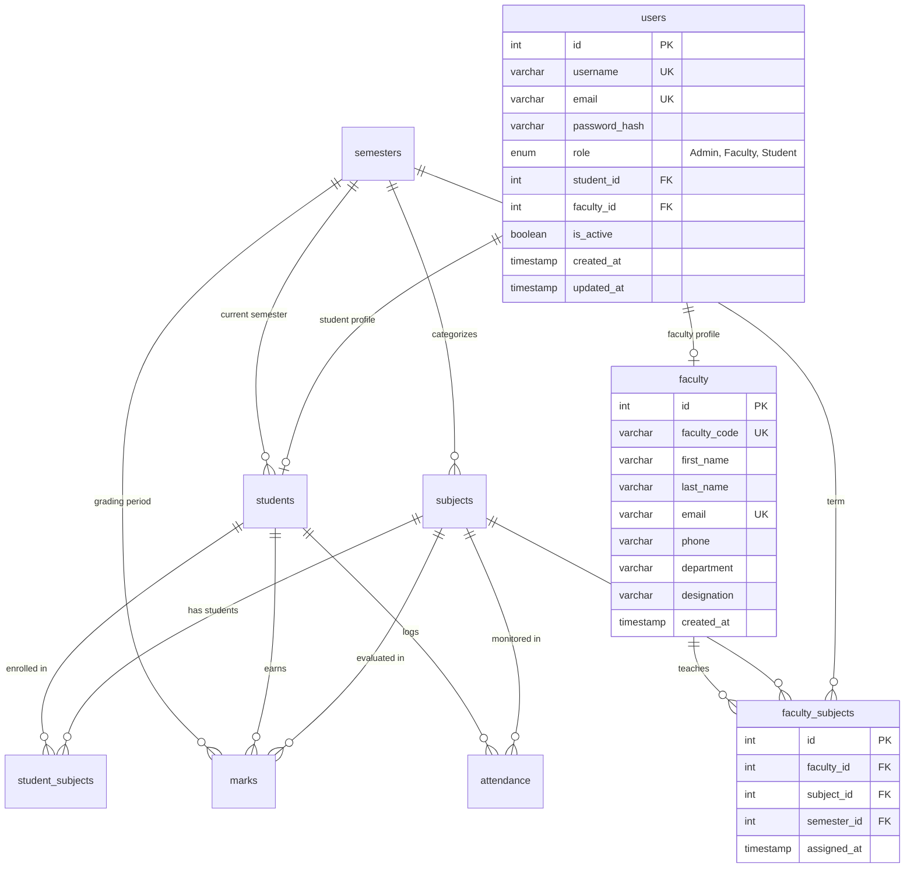

# Student Management System (SMS) - Version 2.0

A production-ready, secure, and modular Student Management System built using **Python**, **Flask**, and **MySQL**, featuring backend-enforced **Role-Based Access Control (RBAC)**, an interactive **Student Analytics Dashboard**, and **Multi-Format Report Exports (JSON, CSV, PDF)**.

---

## Table of Contents
1. [What's New in Version 2.0](#1-whats-new-in-version-20)
2. [Architecture & Design](#2-architecture--design)
3. [Database Schema (3NF)](#3-database-schema-3nf)
4. [Project Folder Structure](#4-project-folder-structure)
5. [Role-Based Access Control (RBAC) Matrix](#5-role-based-access-control-rbac-matrix)
6. [Pre-Configured Accounts](#6-pre-configured-accounts)
7. [Setup & Installation](#7-setup--installation)
8. [Database Initialization & Migration](#8-database-initialization--migration)
9. [Running the Application](#9-running-the-application)
10. [Running the Test Suite](#10-running-the-test-suite)
11. [V2 API Documentation](#11-v2-api-documentation)
12. [Analytics & Mathematical Engine](#12-analytics--mathematical-engine)
13. [Report Export Formats](#13-report-export-formats)

---

## 1. What's New in Version 2.0

Version 2.0 elevates the system from an open REST utility to an enterprise-grade academic platform with three major pillars:

1. **Role-Based Access Control (RBAC) & IDOR Protection**:
   - Three distinct roles: **Admin**, **Faculty**, and **Student**.
   - Backend-enforced authorization via decorators (`@login_required`, `@roles_required`) and object-level scoping functions (`check_student_scope`, `check_subject_management_scope`).
   - Strict defense against Insecure Direct Object References (IDOR): students cannot inspect or download other students' grades or transcripts.
   - Dual authentication: Signed HTTP-only session cookies for web browsers and tamper-proof bearer tokens (`itsdangerous`) for API clients.
   - Universal account self-registration (`/register` and in-dashboard modal) with instant auto-login.

2. **Student Analytics Dashboard**:
   - Role-specific analytical views calculating metrics dynamically from live MySQL data without hardcoded values.
   - **Student View**: Subject-wise marks breakdown, overall weighted average, CGPA, attendance rates, best/weakest subject comparisons, and assessment trends.
   - **Faculty View**: Course load, class averages, pass rates, and student enrollments for assigned subjects.
   - **Admin View**: Total student count, department distributions, system KPIs, and low-attendance risk alerts.
   - Zero-division safety: handles missing marks and absent attendance records gracefully.

3. **Multi-Format Reports Center**:
   - 5 comprehensive reports: Student Academic Transcript, Marks Registry, Attendance Logs, Subject Class Performance, and Semester Term Summary.
   - Dual-streaming export formats: **Web JSON** (`?format=json`), **RFC 4180 CSV** (`?format=csv`), and **Vector PDF** (`?format=pdf` powered by `reportlab`) with academic headers, data tables, and page counters.

---

## 2. Architecture & Design

The application follows a clean **3-Tier Layered Architecture**:

```
[ Web Browser (Dashboard/Login/Register) / REST API Clients ]
                          │
                          ▼
            [ Security & Auth Guard ]
    (Session Cookie & Bearer Token Verification, RBAC Check)
                          │
                          ▼
         [ Flask API Layer (Blueprints) ]
   (Route handling, validation, JSON/CSV/PDF response envelopes)
                          │
                          ▼
        [ Service Layer (Business Logic) ]
  (Analytics calculations, GPA logic, permissions, ReportLab generation)
                          │
                          ▼
          [ Repository / DAO Layer ]
  (Parameterized SQL queries, CRUD operations, transaction boundaries)
                          │
                          ▼
          [ PyMySQL Connection Pool ]
  (ACID transaction context managers, parameter binding)
                          │
                          ▼
         [ MySQL 8.0+ Database (3NF) ]
  (Relational tables, foreign keys, composite indexes, constraints)
```

---

## 3. Database Schema (3NF)

The database schema is fully normalized to **Third Normal Form (3NF)** with explicit foreign keys, cascade rules, and indexes. V2 introduces `faculty`, `users`, and `faculty_subjects` without modifying existing V1 tables.



---

## 4. Project Folder Structure

```
student_system/
├── .env.example              # Template environment configuration
├── .env                      # Local configuration (Git-ignored)
├── requirements.txt          # Python dependencies (Flask, PyMySQL, reportlab, waitress)
├── config.py                 # Centralized configuration & environment loader
├── run.py                    # Application entry point
├── app/
│   ├── __init__.py           # Application Factory, Blueprint registration & web routes
│   ├── db.py                 # Thread-safe MySQL connection & transaction management
│   ├── api/                  # Flask Blueprints (API endpoints)
│   │   ├── __init__.py
│   │   ├── auth.py           # Login, logout, profile (/me), and signup endpoints
│   │   ├── analytics.py      # Student, faculty, and overview analytics routes
│   │   ├── reports.py        # Multi-format reports (JSON, CSV, PDF) with RBAC
│   │   ├── faculty.py        # Faculty CRUD & course assignment
│   │   ├── students.py       # Student CRUD & enrollment
│   │   ├── subjects.py       # Subject CRUD & department filters
│   │   ├── semesters.py      # Semester CRUD & active term toggle
│   │   ├── marks.py          # Assessment grading & atomic batch operations
│   │   └── attendance.py     # Attendance tracking & batch operations
│   ├── services/             # Business & calculation logic
│   │   ├── __init__.py
│   │   ├── auth_service.py   # Password hashing (PBKDF2) & user provisioning
│   │   ├── analytics_service.py # Dynamic metrics, averages, comparisons & trends
│   │   ├── report_generator.py  # ReportLab PDF & CSV streaming generator
│   │   ├── report_service.py # Academic transcript & attendance calculations
│   │   ├── student_service.py
│   │   ├── mark_service.py
│   │   └── attendance_service.py
│   ├── repositories/         # Parameterized SQL data access layer
│   │   ├── __init__.py
│   │   ├── user_repo.py      # User authentication queries
│   │   ├── faculty_repo.py   # Faculty records & teaching assignments
│   │   ├── student_repo.py
│   │   ├── subject_repo.py
│   │   ├── semester_repo.py
│   │   ├── mark_repo.py
│   │   └── attendance_repo.py
│   ├── templates/            # Frontend interfaces
│   │   ├── dashboard.html    # Interactive V2 Dashboard with role switcher & charts
│   │   ├── register.html     # Universal role registration page
│   │   └── login.html        # Dedicated sign-in page
│   └── utils/                # Cross-cutting utilities
│       ├── __init__.py
│       ├── auth.py           # RBAC decorators, token signing, IDOR validation
│       ├── exceptions.py     # Custom exceptions (401, 403, 404, 409, 422)
│       ├── responses.py      # Standardized JSON response envelope
│       └── validators.py     # Payload validators & parameter sanitization
├── schema/
│   ├── schema.sql            # Base MySQL DDL schema
│   ├── migrate_v2.py         # Additive V2 migration script (preserves existing data)
│   ├── seed.sql              # Base seed data
│   └── init_db.py            # Database initializer script
└── tests/                    # Automated test suite (42 tests, 100% passing)
    ├── conftest.py           # SQLite in-memory test database fixture
    ├── test_v2_features.py   # RBAC, IDOR, analytics, registration & export tests
    ├── test_api_common.py    # Error handling & status code tests
    ├── test_students.py      # Student profile & enrollment tests
    ├── test_subjects.py      # Subject & department tests
    ├── test_semesters.py     # Semester validation tests
    ├── test_marks.py         # Marks bounds & batch transaction tests
    ├── test_attendance.py    # Attendance logging & summary tests
    ├── test_reports.py       # Transcript & report tests
    └── test_validators.py    # Validation unit tests
```

---

## 5. Role-Based Access Control (RBAC) Matrix

| Endpoint | Method | Admin | Faculty | Student | Security Policy |
| :--- | :---: | :---: | :---: | :---: | :--- |
| `/api/v1/auth/signup` | `POST` | ✅ | ✅ | ✅ | Public self-registration (auto-login enabled) |
| `/api/v1/auth/login` | `POST` | ✅ | ✅ | ✅ | Public sign-in (session cookie + bearer token) |
| `/api/v1/auth/me` | `GET` | ✅ | ✅ | ✅ | Authenticated session profile |
| `/api/v1/faculty/**` | Any | ✅ | ❌ | ❌ | Admin only |
| `/api/v1/students` | `POST` | ✅ | ❌ | ❌ | Admin only |
| `/api/v1/students` | `GET` | ✅ | ✅ | ❌ | Students restricted to their own record |
| `/api/v1/students/<id>` | `GET` | ✅ | ✅* | ✅* | `*` Scoped: Faculty must teach course; Student must own ID |
| `/api/v1/analytics/student/<id>` | `GET` | ✅ | ✅* | ✅* | `*` IDOR Protection: Students blocked from viewing others |
| `/api/v1/analytics/student/me` | `GET` | ❌ | ❌ | ✅ | Automatically resolves student ID from session |
| `/api/v1/analytics/faculty` | `GET` | ✅ | ✅ | ❌ | Shows courses assigned to faculty member |
| `/api/v1/analytics/overview` | `GET` | ✅ | ❌ | ❌ | System-wide statistics |
| `/api/v1/reports/academic` | `GET` | ✅ | ✅* | ✅* | Supports `?format=json\|csv\|pdf` with IDOR check |
| `/api/v1/reports/marks` | `GET` | ✅ | ✅* | ✅* | Supports `?format=json\|csv\|pdf` scoped by role |
| `/api/v1/reports/attendance` | `GET` | ✅ | ✅* | ✅* | Supports `?format=json\|csv\|pdf` scoped by role |
| `/api/v1/reports/subject/<id>` | `GET` | ✅ | ✅* | ❌ | `*` Faculty must be assigned to subject |
| `/api/v1/reports/semester/<id>`| `GET` | ✅ | ✅ | ❌ | Faculty/Admin term statistics |

---

## 6. Pre-Configured Accounts

The V2 migration script initializes three pre-seeded accounts:

| Role | Username | Password | Linked Entity / Permissions |
| :--- | :--- | :--- | :--- |
| **Admin** | `admin` | `Admin@123` | Complete administrative access across all modules |
| **Faculty** | `faculty_turing` | `Faculty@123` | Linked to Faculty ID 1 (Assigned to Subject ID 1) |
| **Student** | `student_25291a6601` | `Student@123` | Linked to Student `25291A6601` (Bijjam Charan Kumar Reddy) |

---

## 7. Setup & Installation

### Prerequisites
- **Python**: Version 3.10 or higher
- **MySQL Server**: Version 8.0 or higher

### Steps

1. **Navigate to the Directory**:
   ```powershell
   cd C:\Users\bijja\student_web\student_system
   ```

2. **Activate Virtual Environment** (Optional):
   ```powershell
   python -m venv venv
   .\venv\Scripts\activate
   ```

3. **Install Dependencies**:
   ```powershell
   pip install -r requirements.txt
   ```

4. **Configure Environment Variables (`.env`)**:
   ```env
   DB_HOST=localhost
   DB_PORT=3306
   DB_USER=student_app
   DB_PASSWORD=your_password_here
   DB_NAME=student_management_db

   FLASK_ENV=development
   FLASK_DEBUG=0
   PORT=5000
   SECRET_KEY=your-secure-random-secret-key
   ```

---

## 8. Database Initialization & Migration

- **Apply V2 Additive Migration (Preserves all existing V1 data)**:
  ```powershell
  python schema/migrate_v2.py
  ```
  *Creates `faculty`, `users`, and `faculty_subjects` tables and seeds initial users without altering existing records.*

- **Fresh Install / Reset (Optional, drops and recreates schema)**:
  ```powershell
  python schema/init_db.py --seed
  ```

---

## 9. Running the Application

### Development Mode
```powershell
python run.py
```

### Production WSGI Mode (Recommended)
```powershell
python -m waitress --port=5000 run:app
```

The web dashboard is accessible at:
- **Interactive Dashboard**: `http://localhost:5000/dashboard`
- **Universal Registration**: `http://localhost:5000/register`
- **Sign In Page**: `http://localhost:5000/login`

---

## 10. Running the Test Suite

All 42 automated unit and integration tests run out-of-the-box using the SQLite in-memory adapter without requiring an active external MySQL server:

```powershell
python -m pytest -v
```

**Test Coverage Highlights**:
- Role-based authorization & IDOR defense (`test_v2_rbac_and_idor_protection`)
- Student analytics calculation engine (`test_v2_analytics_calculations`)
- Multi-format reports export in JSON, CSV, and PDF (`test_v2_multi_format_reports`)
- Public user registration & re-login across all roles (`test_v2_public_registration_and_login`)
- Atomic transaction rollbacks on failure (`test_batch_attendance_transaction_rollback`, `test_batch_record_marks_transaction_rollback`)

---

## 11. V2 API Documentation

### Authentication (`/api/v1/auth`)

| Endpoint | Method | Payload / Params | Description |
|---|---|---|---|
| `/api/v1/auth/signup` | `POST` | `username`, `email`, `password`, `role`, `first_name`, `last_name`, optional `roll_number`/`faculty_code` | Public user registration for all roles. Automatically provisions profiles and logs user in. |
| `/api/v1/auth/login` | `POST` | `username`, `password` | Authenticates credentials and returns a signed bearer token + session cookie. |
| `/api/v1/auth/logout` | `POST` | None | Clears the authenticated session. |
| `/api/v1/auth/me` | `GET` | None | Returns the currently authenticated user's profile and roles. |
| `/api/v1/auth/register` | `POST` | `username`, `email`, `password`, `role` | Administrator-only account creation endpoint. |

---

### Analytics (`/api/v1/analytics`)

| Endpoint | Method | Query / Path Params | Description |
|---|---|---|---|
| `/api/v1/analytics/student/<id>` | `GET` | `student_id` | Student performance analytics (IDOR protected: Admin, Faculty teaching student, or Student self). |
| `/api/v1/analytics/student/me` | `GET` | None | Resolves student ID from session and returns self analytics. |
| `/api/v1/analytics/faculty` | `GET` | None | Analytical performance summary across all courses assigned to the logged-in faculty member. |
| `/api/v1/analytics/overview` | `GET` | None | Administrative overview: total students, faculty, courses, department distributions, low-attendance alerts. |

---

### Reports (`/api/v1/reports`)

All report endpoints support `?format=json` (default), `?format=csv`, and `?format=pdf`.

| Endpoint | Method | Parameters | Description |
|---|---|---|---|
| `/api/v1/reports/academic` | `GET` | `student_id`, `format` | Complete academic transcript with GPA, course credits, and graded evaluations. |
| `/api/v1/reports/marks` | `GET` | `subject_id`, `semester_id`, `student_id`, `format` | Assessment marks registry with obtained/max points, percentages, and letter grades. |
| `/api/v1/reports/attendance` | `GET` | `subject_id`, `student_id`, `date_from`, `date_to`, `format` | Detailed attendance logs with present, absent, late, and excused records. |
| `/api/v1/reports/subject/<id>` | `GET` | `subject_id`, `format` | Course class performance report: class average %, pass rate %, enrolled count, score range. |
| `/api/v1/reports/semester/<id>`| `GET` | `semester_id`, `format` | Semester term report: enrolled course listings, departments, and term average %. |
| `/api/v1/reports/attendance/low`| `GET` | `threshold` (default 75) | Identifies all students falling below the minimum attendance threshold. |

---

## 12. Analytics & Mathematical Engine

Analytics calculations are dynamically evaluated from live database records:

1. **Subject Average Percentage**:
   $$\text{Subject } \% = \frac{\sum \text{marks\_obtained}}{\sum \text{max\_marks}} \times 100$$

2. **Overall Average Percentage**:
   $$\text{Overall } \% = \frac{\sum_{\text{all exams}} \text{marks\_obtained}}{\sum_{\text{all exams}} \text{max\_marks}} \times 100$$

3. **Cumulative Grade Point Average (CGPA)**:
   $$\text{CGPA} = \frac{\sum (\text{Grade Points}_i \times \text{Credits}_i)}{\sum \text{Credits}_i}$$

4. **Attendance Rate**:
   $$\text{Attendance } \% = \frac{\text{Present} + \text{Excused}}{\text{Total Sessions Logged}} \times 100$$

5. **Subject Comparison**:
   Sorts all enrolled subjects by percentage to identify the student's highest-performing course and the subject requiring focus.

---

## 13. Report Export Formats

- **Web JSON (`?format=json`)**: Standardized REST envelope (`success`, `message`, `data`, `meta`).
- **RFC 4180 CSV (`?format=csv`)**: Streams a `.csv` download with `Content-Type: text/csv` and `Content-Disposition: attachment; filename="..."`.
- **Vector PDF (`?format=pdf`)**: Programmatically built via `reportlab` utilizing:
  - Header styling with university/institution title.
  - Metadata definition lists (student roll, term, dates, user role).
  - Auto-wrapped tabular data with alternating row fills and letter grade badges.
  - Dynamic multi-page footer counters (`Page X of Y`).

---

## License & Support

This project is licensed for educational and administrative management purposes. Built with Python 3.10+, Flask 3.1, MySQL 8.0, and ReportLab.
